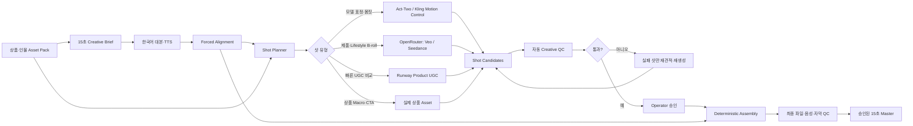
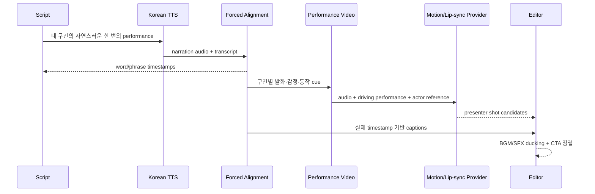

# Production 영상 품질·모션 아키텍처

- 최종 정리일: 2026-09-05
- Provider 조사 기준일: 2026-09-04
- 문서 상태: 최종 설계 기준
- 구현 상태: 제안된 target architecture이며, 현재 코드는 아직 이 문서의 전체 인수 기준을 충족하지 않는다.

## 1. 의사결정 요약

Production 품질을 만들기 위해 필요한 핵심 변경은 provider 전체 교체가 아니라
**15초 통생성을 샷 단위 생성·선택·합성으로 전환하는 것**이다.

권장 provider 구성은 다음과 같다.

- OpenRouter는 Veo·Seedance 계열의 제품 및 lifestyle B-roll 라우터로 유지한다.
- 가장 빠른 UGC 품질 비교군으로 Runway Product UGC를 별도 provider로 추가한다.
- 모델의 몸짓·표정·발화를 직접 통제해야 하는 샷에는 Runway Act-Two 또는
  Kling Motion Control의 driving-performance 경로를 사용한다.
- 제품 로고·패키지·가격·CTA는 생성 영상에 맡기지 않고 실제 상품 자산과 로컬
  렌더링으로 고정한다.
- Higgsfield는 UGC 템플릿과 Soul ID를 이용한 수동 creative benchmark로 사용하되,
  공개 API에서 자동화 계약을 확인하기 전에는 production 핵심 경로로 채택하지 않는다.

즉 목표 조합은 다음과 같다.

> OpenRouter B-roll + performance-driven 인물 샷 + 실제 제품 합성 + deterministic CTA

## 2. 현재 결과와 문제 정의

현재 15초 job `3d756c1cd3ae4237a1005847022b55d3`의 최종 결과는 1080×1920,
15.066667초, H.264, 30fps이고 기술 점수 100을 받았다. 그러나 0.5초, 3.5초,
6.5초, 9.5초, 12.5초의 표본 프레임은 모두 같은 주방, 비슷한 상반신 구도,
가슴 높이의 상품 홀딩을 유지했다. 얼굴과 손의 작은 변화는 있지만 광고 편집으로
느껴질 정도의 동작 또는 샷 전환은 없다.

따라서 이 결과는 다음 두 판정을 분리해야 한다.

| 판정 | 현재 상태 | 의미 |
| --- | --- | --- |
| 기술 파일 품질 | PASS | 세로 해상도, 길이, fps, codec, bitrate, black frame 기준 통과 |
| Creative production 품질 | NO-GO | 동작, 얼굴·손·상품 일관성, 편집 리듬, 한국어 동기화 기준 미충족 |

## 3. 근본 원인

### 3.1 15초 전체를 한 번에 생성한다

현재 `app/api/v1/final_generation.py`의 후보 실행은 한 후보에 대해 전체 길이의
`_generate_video()`를 한 번 호출한다. 네 개의 기획 구간은 샷별 generation job이 아니라
하나의 Markdown 표로 합쳐진 prompt다.

한 요청이 동시에 해결해야 하는 항목은 다음과 같다.

- 동일한 얼굴과 의상
- 자연스러운 손과 제품 접촉
- 정확한 상품 형태와 라벨
- 네 구간의 서로 다른 행동
- 0~3, 3~8, 8~12, 12~15초 시간표
- 카메라 및 공간 연속성

실패 위험이 커질수록 모델은 가장 안전한 결과인 "한 장소에서 상품을 들고 서 있기"로
수렴한다. 모델명만 바꿔도 이 구조적 문제는 남는다.

### 3.2 Prompt가 정적인 장면을 유도한다

현재 `app/prompt_defaults/video_base.txt`에는 카메라 지시가 `slight handheld motion`으로만
정의돼 있다. `video_generated_model.txt`도 대부분의 시간에 상반신·얼굴과 제품을 함께
보여주도록 요구한다.

각 장면의 시작 자세, 동작 경로, 속도, 제품 접촉점, 종료 자세는 구조화돼 있지 않다.
영상 모델에는 장면의 `visual`과 시간 범위 중심으로 전달되며, script의 `intent`, `notes`,
전역 required/forbidden 연출도 충분히 보존되지 않는다.

### 3.3 Provider별 제어 기능을 쓰지 않는다

현재 OpenRouter 요청은 공통적으로 model, prompt, duration, size, audio 여부, image
reference를 전달한다. 다음과 같은 provider 고유 기능은 generation contract에 없다.

- start/end frame
- motion strength 및 camera preset
- reference 역할·강도
- driver video와 performance transfer
- character/identity lock
- provider별 negative prompt
- native lip-sync와 audio control

따라서 환경변수의 모델 ID만 변경하면 새로운 모델의 핵심 장점을 사용하지 못한다.

### 3.4 인물·상품 reference가 부족하다

`generated_model`은 특정 인물 reference 없이 text prompt로 인물을 만든다. 현재 production
request는 상품 정면 이미지 한 장을 사용하고 detail image는 비어 있다. 모델이 제품을
회전시키거나 손으로 조작하면 보이지 않는 측면·뒷면·두께·라벨을 추론해야 한다.

### 3.5 Creative QC가 없다

`app/video_validator.py`는 화면비, 해상도, 길이, fps, codec, bitrate, black frame을
검사한다. 다음 항목은 현재 기술 점수에 포함되지 않는다.

- 얼굴 identity drift
- 손가락·손목·팔의 형태 오류
- 손과 제품의 미끄러짐 또는 관통
- 제품 색상·형태·라벨 변형
- 움직임 부족, jitter, foot slide
- 장면 사이 continuity
- 한국어 발음과 lip-sync
- Hook 이해도와 CTA 기억도

완료된 첫 후보를 기본 선택하는 현재 방식으로는 "생성 성공"과 "광고 사용 가능"을
구분할 수 없다.

### 3.6 한국어 음성이 영상과 독립적으로 배치된다

현재 `app/tts_generator.py`는 전체 문장을 한 performance로 생성하지만 실제 단어 timestamp를
기반으로 네 기획 구간을 정렬하지 않는다. `app/hyperframes_caption.py`도 실제 발화 시점이
아니라 script scene의 예정 시간을 자막에 사용한다.

자연스러운 한국어 모델 광고에는 `음성 확정 → 실제 발화 정렬 → 동작/lip-sync → 자막` 순서가
필요하다.

## 4. 목표 아키텍처



핵심 데이터 구조는 완성 영상 후보 중심이 아니라 다음 계층으로 바꾼다.

```text
generation_job
└── segments
    └── shots
        ├── shot_plan_snapshot
        ├── shot_attempts
        │   ├── provider_request_snapshot
        │   ├── quote_and_actual_cost
        │   ├── generated_artifact
        │   └── qc_result
        └── selected_artifact
└── assembly_versions
    ├── selected_shot_ids
    ├── narration_alignment
    ├── caption_track
    ├── product_overlay
    └── final_qc_result
```

## 5. 15초 Shot Contract

기존의 네 개 사용자 구간은 유지하되 실제 제작은 7개 편집 샷으로 나눈다.

| 시간 | 샷 | 동작 | 생성 제약과 제작 방식 |
| --- | --- | --- | --- |
| 0~1.2초 | H1 | 제품을 든 모델이 반걸음 들어오며 허리에서 가슴까지 올린다 | 카메라 고정, 손 교체 금지, performance-driven |
| 1.2~3초 | H2 | 제품을 본 뒤 시청자 쪽으로 시선을 옮기며 작게 웃는다 | 머리 회전 10~15도, push-in 최대 3% |
| 3~5.4초 | P1 | 제품 형태와 주요 부분을 보여주는 macro | 실제 packshot 또는 실제 제품 B-roll 우선 |
| 5.4~8초 | P2 | 한 손 grip을 유지하고 다른 손으로 한 지점을 가리킨다 | 개봉·손 교차 금지, 고위험 샷은 후보 3개 |
| 8~10.3초 | L1 | 제품은 고정한 채 다른 손으로 tote strap을 어깨에 멘다 | 체중 이동 한 번, 몸통 회전 15도 이내 |
| 10.3~12초 | L2 | 출구 방향으로 한 걸음 이동한다 | 긴 보행과 가방 속 제품 삽입 금지 |
| 12~15초 | C1/C2 | 제품을 8~10cm 앞으로 제시한 뒤 0.4초 멈추고 CTA로 전환한다 | 실제 제품 cutout과 CTA를 로컬 렌더 |

샷 prompt 공통 규칙:

- 주 동작은 한 샷에 하나만 둔다.
- 카메라 동작은 없거나 하나만 둔다.
- 동작은 `anticipation 10% → action 60% → settle 30%`로 설명한다.
- 생성 clip 앞뒤에 0.5~1초 handle을 두고 안정된 구간만 사용한다.
- 상품을 잡는 동안 손목과 상품의 상대 위치를 유지한다.
- 손 교체, 양손 전달, 얼굴 앞 제품 이동, 긴 보행, AI-only 개봉·마시기는 피한다.
- 라벨과 CTA text는 생성하지 않고 원본 asset으로 합성한다.

## 6. Asset Pack 계약

### 6.1 상품

- 정면, 좌우 45도, 측면, 뒷면, 상단·캡
- 실제 손에 든 크기를 확인할 수 있는 이미지
- 2K 이상 원본과 투명 PNG mask
- 실물 크기, SKU, 색상 기준, 검증된 판매 문구
- 작은 글자와 로고의 원본 artwork

상품 catalog에는 `asset_pack_revision`과 다음 readiness를 저장한다.

- `UGC_READY`: multi-view, mask, 크기·SKU 정보가 있어 인물 상호작용 가능
- `BASIC_ONLY`: 정면 packshot만 있어 product-only 또는 deterministic CTA만 가능
- `BLOCKED`: SKU가 모호하거나 권리·접근성·품질 검증 실패

### 6.2 인물

- 정면, 좌우 45도, 프로필 얼굴
- 상반신, 전신, 양손이 보이는 이미지
- 동일한 헤어·의상·메이크업·조명
- 합성 인물 ID 또는 실제 인물의 명시적 사용 동의와 범위
- 음성 clone을 사용할 경우 별도 음성 권리와 삭제 정책

### 6.3 샷 Keyframe

각 샷은 생성 전에 다음을 승인한다.

- start/end keyframe hash
- 얼굴과 제품 bounding box
- 상품을 드는 손과 grip 위치
- camera/framing
- 이전 샷에서 이어지는 pose, screen direction, lighting

## 7. Provider 전략

아래 내용은 2026-09-04 공식 문서 및 live catalog 기준이다. 가격과 제공 기능은 실행 직전
estimate 또는 model catalog로 다시 확인한다.

현재 로컬에서 실제 유료 생성까지 검증한 경로는 OpenRouter Seedance다. Runway Product UGC,
Act-Two, Kling Motion Control, Higgsfield는 공식 capability와 가격을 조사한 비교군이며, 이
문서는 해당 provider의 실제 결과 품질을 검증했다고 주장하지 않는다.

| 경로 | 주요 기능 | 이 프로젝트의 역할 | 주요 제한 |
| --- | --- | --- | --- |
| OpenRouter | 비동기 Video API, reference, first/last frame, audio, webhook, 다중 모델 | Veo·Seedance 제품/lifestyle B-roll 라우터 | 전문 performance-transfer endpoint는 표준 계약에 없음 |
| Runway Product UGC | 인물 이미지 + 제품 이미지 + 상품 정보 + 대본, 4~15초, 세로 720p/1080p, audio | 가장 빠른 one-call UGC A/B | 결과를 그대로 승인하지 말고 제품·음성 QC 필요 |
| Runway Act-Two | 3~30초 driving video의 표정·발화·제스처·몸동작 전이 | Hook, talking presenter, 자연스러운 몸짓 | 생성 상품 접촉보다 인물 performance 중심 |
| Kling Motion Control | motion reference 기반 전신·표정 전이, 3~30초, 720p/1080p | 걷기·몸짓·손동작 통제 후보 | 빠르고 복잡한 동작, 컷이 있는 reference는 부적합 |
| Veo 3.1 | 4/6/8초, 9:16, 720p~4K, first/last frame, native audio | 고품질 hero와 lifestyle shot | 짧은 샷 단위 사용 필요, 인물·상품을 동시에 고정하는 능력은 별도 검증 |
| Seedance 2.0 | 현재 로컬에서 상품 image reference와 4~15초 1080p 생성 확인 | 제품·공간 continuity 및 기본 B-roll | audio/video reference와 복잡한 몸동작은 별도 canary 필요 |
| Seedance 2.5 | OpenRouter live catalog 기준 4~30초, 480p/720p | 장시간·저해상도 대안 비교군 | audio/video reference 계약과 production FHD는 현재 프로젝트에서 미검증 |
| Higgsfield Studio | Marketing Studio, Soul ID, UGC template, camera preset | 수동 creative benchmark와 방향 탐색 | 공개 REST spec에 핵심 Marketing/Cinema 계약이 없어 자동화 경로로는 보류 |

### 7.1 최종 선택

1. OpenRouter를 제거하지 않는다.
2. Runway Product UGC를 첫 direct provider adapter로 추가한다.
3. `driving_performance` 입력과 Act-Two 또는 Kling adapter를 추가한다.
4. Higgsfield는 동일 brief로 수동 결과를 만든 뒤 blind review 비교군에 포함한다.
5. 특정 provider를 전역 기본값으로 고정하지 않고 shot capability별로 routing한다.

### 7.2 비용 예시

공식 공개 가격으로 단순 계산한 비교 예시는 다음과 같다.

| 경로 | 15초 예시 | 포함 범위 |
| --- | ---: | --- |
| 현재 로컬 Seedance 완성 후보 | 약 $5.63 | 실제 기록, 15초 통생성 1개 |
| Runway Product UGC 720p | 약 $5.88 | 공식 4초 기본금액 + 이후 초당 단가 |
| Runway Product UGC 1080p | 약 $6.48 | 공식 4초 기본금액 + 이후 초당 단가 |
| Runway Act-Two | 약 $0.75 | motion transfer만 계산, 제품 합성·후반작업 제외 |
| Kling Motion Control 1080p | 약 $2.52 | motion transfer 15초, 후반작업 제외 |

샷 기반 견적은 최종 길이 15초가 아니라 다음 식으로 계산한다.

```text
예상 provider 비용
= Σ(shot provider duration × candidate count × provider rate)
+ UGC recipe fixed/variable cost
+ upscale/edit/audio 비용
```

다만 의사결정 지표는 생성 1회 가격이 아니라 다음 값이다.

```text
Cost Per Approved Video
= 전체 provider·후반작업 비용 / 최종 승인 영상 수
```

실패한 2초 샷 때문에 15초 전체를 다시 생성하지 않으므로 샷 기반 구조는 단건 비용이
증가하더라도 승인 완성본당 비용을 안정화할 수 있다.

## 8. 한국어 음성·Lip-sync 파이프라인



필수 규칙:

- 최종 한국어 대사를 먼저 확정한다.
- 한 번의 자연스러운 performance를 생성하고 강제 정렬로 word/phrase timestamp를 얻는다.
- 영상 전체를 1.3배까지 늘려 맞추는 방식은 제거하고 phrase 사이 무음과 샷 길이를 조절한다.
- talking shot은 같은 audio를 driving performance와 lip-sync 입력에 사용한다.
- 자막은 script 예정 시간이 아니라 실제 발화 timestamp를 사용한다.
- CTA 발화 시작은 12.0~12.3초, 영상 종료 초과는 100ms 이하로 제한한다.
- 최종 loudness는 `-16 LUFS ±1`, true peak는 `-1 dBTP` 이하로 맞춘다.

## 9. Backend 구현 계약

### 9.1 Provider adapter

provider마다 최소 다음 capability를 선언한다.

```text
supported_durations
supported_resolutions
identity_references
product_references
first_and_last_frame
driver_video
motion_controls
negative_prompt
native_audio
lip_sync
cost_estimator
submit_and_resume
```

공통 payload로 capability를 잃지 않도록 `SeedanceProvider`, `VeoProvider`,
`RunwayUgcProvider`, `ActTwoProvider`, `KlingMotionProvider`를 분리한다.

### 9.2 Job과 비동기 처리

- `segments`, `shots`, `shot_attempts`, `selected_artifact`, `assembly_versions`를 정규화한다.
- quote와 job에 actor/product asset revision, prompt version, model/version, seed, keyframe hash를
  snapshot으로 저장한다.
- provider submit과 poll을 분리하고 provider operation ID를 즉시 저장한다.
- 실패한 shot만 명시적인 새 견적과 승인 후 다시 요청한다.
- process restart 뒤에도 paid POST를 반복하지 않고 기존 operation을 resume한다.
- source와 결과 artifact는 checksum과 함께 object storage에 저장한다.
- 자동 유료 재시도는 하지 않는다.

### 9.3 Prompt version

현재 prompt version UI와 snapshot 계약을 확장해 다음 template을 별도 버전으로 관리한다.

- `shot_planner`
- `keyframe`
- `motion_shot`
- `product_broll`
- `creative_qc`
- `assembly_direction`

활성 버전 변경은 신규 quote/job에만 적용하고 진행 중 job과 과거 결과의 snapshot은 바꾸지 않는다.

## 10. Frontend UX 요구사항

### 10.1 생성 전

- 상품별 `UGC_READY / BASIC_ONLY / BLOCKED` 상태와 부족한 asset을 표시한다.
- 4/6/8/15초 전략 아래에 실제 shot storyboard를 보여준다.
- shot별 provider, 생성 길이, 후보 수, 예상 비용을 표시한다.
- 한국어 음성, actor pack, product asset revision을 최종 생성 전에 확인한다.
- fresh quote 없이 유료 CTA를 활성화하지 않는다.

### 10.2 생성 중

- 전체 job progress와 shot별 상태를 분리한다.
- `keyframe → submitted → generating → QC → selected → assembled` 단계를 표시한다.
- polling/webhook 단절 후에도 job ID로 복구한다.
- 사용자 승인 없이 새 유료 attempt를 시작하지 않는다.

### 10.3 검수

- storyboard 순서로 샷 후보를 나란히 재생한다.
- 얼굴, 상품, 손, motion, audio, continuity 점수를 분리해 표시한다.
- 실패 code와 재시도 시 바뀌는 입력·예상 비용을 알려준다.
- 샷별 선택을 서버에 저장하고 선택 조합으로 무과금 재조립할 수 있게 한다.
- 최종본과 provider 원본, narration, caption timing을 구분해 다운로드한다.

## 11. QC와 Hard Fail

### 11.1 실패 코드

- `IDENTITY_DRIFT`
- `PRODUCT_SHAPE_DRIFT`
- `PRODUCT_LABEL_MUTATION`
- `PRODUCT_DUPLICATION`
- `HAND_ANATOMY`
- `GRIP_SLIP`
- `ACTION_INCOMPLETE`
- `MOTION_TOO_STATIC`
- `MOTION_JITTER`
- `FOOT_SLIDE`
- `CAMERA_UNPLANNED`
- `CONTINUITY_MISMATCH`
- `TEXT_HALLUCINATION`
- `CLAIM_UNVERIFIED`
- `AUDIO_PRONUNCIATION`
- `AUDIO_ALIGNMENT`
- `EDIT_REPAIRABLE`

얼굴·손·제품·광고 진실성 오류는 점수와 관계없이 hard fail이다. 컷, 자막, 색상, 음량처럼
로컬 편집으로 수정 가능한 항목만 `EDIT_REPAIRABLE`로 분류한다.

### 11.2 자동 Gate

- 설계된 hold 외 0.5초 이상 freeze 없음
- 동작 구간의 지정 관절 또는 인물 중심 이동량이 화면 크기의 4~18%
- 컷 이외 위치 jump가 frame diagonal의 4% 미만
- grip 구간의 손과 제품 상대 위치 변화가 frame diagonal의 2% 이내
- 계획된 동작이 샷 길이 85% 전에 끝나고 마지막 안정 프레임이 8장 이상
- 예상 인물 수와 제품 수가 manifest와 일치
- 15.00초 ±0.25초, 1080×1920, 30fps CFR, H.264 또는 HEVC
- black frame 연속 2장 이하

자동 gate는 후보 선별 장치다. 얼굴·손·상품 morphing의 최종 판정은 사람이 수행한다.

### 11.3 사람 검수

- 1배속 무음 시청
- 0.5배속 시청
- 손·제품 접촉 구간 frame scrub
- 세 명 blind review 중앙값: 자연스러운 움직임 4/5 이상
- UGC 현실감 4/5 이상
- 상품 충실도 4.5/5 이상
- 첫 1.5초 Hook 이해도: 다섯 명 중 네 명 이상
- CTA 기억률 80% 이상
- 생성 라벨과 검증되지 않은 광고 문구 0건

## 12. 검증 계획

### 12.1 첫 Canary

서로 다른 특성의 상품 두 개로 다음을 비교한다.

1. 현재 Seedance 15초 통생성
2. 동일 Seedance 샷 단위 생성
3. Runway Product UGC
4. Act-Two 또는 Kling 인물 샷 + OpenRouter 제품 샷 + 로컬 CTA

동일 brief, asset, narration, 검수자를 사용해 "모델 변경 효과"와 "샷 구조 변경 효과"를
분리한다. 초기 engineering 비용 상한은 경로·fixture당 **USD 15**다. 두 상품과 네 경로를
모두 상한까지 실행하면 최대 USD 120이므로, 실제 요청 전 전체 canary 예산을 다시 승인한다.

비용 상한에는 video/TTS/upscale/edit provider API의 실제 청구액을 포함한다. 로컬 연산,
스토리지, 네트워크, 사람 검수 비용은 provider 비용과 섞지 않고 별도 항목으로 보고한다.
상한은 실행 전에 versioned benchmark manifest로만 변경할 수 있으며, 실행 중 임의로 늘리지 않는다.

후보·attempt 예산은 다음과 같이 고정한다.

- 일반 생성 샷: 최초 후보 최대 2개
- 손·제품 상호작용 샷: 최초 후보 최대 3개
- 최초 후보가 모두 실패한 샷: 새 견적과 명시적 승인 후 유료 재시도 최대 1회
- fixture가 USD 15에 도달하면 미승인 샷이 남아 있어도 유료 요청을 중단하고 실패로 기록

### 12.2 출시 Benchmark

canary 통과 후 서로 다른 상품 fixture 10개로 확대한다.

- canary에서 선택한 한 production 경로만 평가하며 provider 총예산 상한은 USD 150
- 10개 중 최소 8개가 fixture당 USD 15 안에서 승인 master를 하나 이상 확보
- shot first-pass usable rate 60% 이상
- 최종 blind approval rate 80% 이상
- 치명적인 얼굴·손·상품·광고 진실성 오류 0건
- 승인 완성본당 비용의 P50/P90 기록
- model/version, prompt version, seed, reference hash, 실제 비용, review 결과 재현 가능

지표의 분모와 집계 규칙은 다음과 같다.

- `shot first-pass usable rate`: 최초 후보 묶음에서 자동 gate와 operator shot 검수를 통과한
  generation shot 수 / 전체 계획된 generation shot 수. 실제 B-roll과 deterministic CTA는 분모에서 제외한다.
- `blind approval rate`: 세 명이 독립 평가한 10개 fixture master 중, hard fail이 없고 세 점수의
  중앙값이 자연스러운 움직임 4/5, UGC 현실감 4/5, 상품 충실도 4.5/5 이상인 master 수 / 10.
  비용 상한 때문에 master를 만들지 못한 fixture도 실패로 분모에 포함한다.
- `fixture approval cost`: 해당 fixture의 최초 승인 master까지 발생한 모든 실패·성공 attempt의
  provider 비용. 승인되지 않은 fixture는 `> USD 15`로 기록하며 비용 통계에서 조용히 제외하지 않는다.
- `Cost Per Approved Video`: 10개 fixture의 전체 실제 provider 비용 / 승인 master 수.
- P50/P90은 승인된 fixture의 approval cost로 계산하되, 미승인 fixture 수와 실제 소진 비용을
  같은 표에 반드시 병기한다.

## 13. 구현 순서와 인수 목록

### P0 — 구조 전환

- [ ] Shot plan schema와 version 추가
- [ ] 네 narrative segment를 4~7개 generation shot으로 변환
- [ ] Start/end keyframe과 continuity snapshot 저장
- [ ] 샷별 quote, attempt, artifact, selection 저장
- [ ] 실패 샷만 재생성하고 선택 샷을 deterministic하게 조립

### P0 — 첫 Provider 비교

- [ ] 동일 Seedance로 통생성 대 샷 생성 비교
- [ ] Runway Product UGC adapter와 estimate/submit/poll 추가
- [ ] 실제 상품 두 개 canary와 blind review
- [ ] Cost Per Approved Video 비교

### P1 — 동작 제어

- [ ] Driving-performance asset 등록과 권리 기록
- [ ] Act-Two 또는 Kling Motion Control adapter 추가
- [ ] Hook 및 lifestyle shot에 motion transfer 적용
- [ ] 손·제품 상호작용 실패 fallback 제공

### P1 — 한국어 음성과 QC

- [ ] 한국어 TTS 입력에 language/voice 계약 고정
- [ ] Word/phrase forced alignment 저장
- [ ] 실제 timestamp 자막과 CTA 정렬
- [ ] motion/identity/product/hand/audio/creative score 분리
- [ ] Hard fail과 operator approval 구현

### P2 — 운영 내구성

- [ ] Durable worker, lease, outbox, provider operation resume
- [ ] Object storage, checksum, retention, signed URL
- [ ] Auth/RBAC, 사용자별 예산, audit log
- [ ] Provider latency·비용·usable-rate 관측성

## 14. Release Gate

다음을 모두 충족하기 전에는 Public Production을 승인하지 않는다.

- 샷 기반 생성과 실패 샷 단위 재시도가 실제 provider로 검증됨
- 선택된 한 production 경로가 10개 fixture, 총 USD 150와 fixture당 USD 15 상한 안에서
  first-pass usable 60%, blind approval 80%를 통과함
- 사람·상품 권리와 asset revision이 job에 고정됨
- 얼굴·손·제품·문구 hard fail이 operator 승인 전에 차단됨
- 한국어 음성·자막·CTA 타이밍이 실제 발화 기준으로 검증됨
- worker 재시작 뒤 paid provider 요청이 중복되지 않음
- 최종 MP4와 입력·prompt·provider·비용·QC evidence가 추적 가능함

## 15. 공식 자료

- [OpenRouter Video Generation](https://openrouter.ai/docs/guides/overview/multimodal/video-generation)
- [OpenRouter live video model catalog](https://openrouter.ai/api/v1/videos/models)
- [Runway Product UGC](https://docs.dev.runwayml.com/recipes/product-ugc/)
- [Runway API pricing](https://docs.dev.runwayml.com/guides/pricing/)
- [Runway Act-Two API](https://dev.runwayml.com/endpoints/character_performance)
- [Kling Motion Control](https://kling.ai/document-api/api/video/motion-control)
- [Kling API pricing](https://kling.ai/dev/pricing)
- [Google Veo video generation](https://ai.google.dev/gemini-api/docs/video)
- [Google Gemini API pricing](https://ai.google.dev/gemini-api/docs/pricing)
- [BytePlus Seedance](https://www.byteplus.com/en/product/seedance)
- [Higgsfield Marketing Studio](https://higgsfield.ai/creator-hub/help-center/tools/how-do-i-use-marketing-studio-to-create-video-ads)
- [Higgsfield public OpenAPI](https://docs.higgsfield.ai/docs/openapi.json)
- [Higgsfield billing and retention](https://docs.higgsfield.ai/docs/concepts/billing-and-retention)
